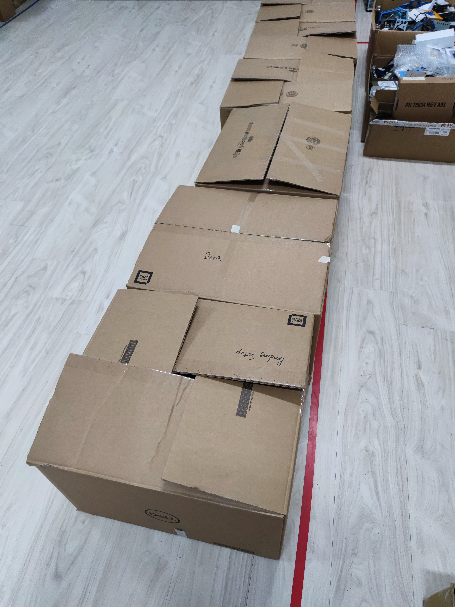
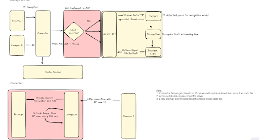

# Log Book Short (20 Nov - 26 Nov 2023)

## Day 1
After my lunch break, I went to the data center room on the second floor where all the assets, accessories, partitions, packing boxes, etc. that will be scrapped in the future are stored. The store's PICs and I were responsible for organizing all the end-of-life monitors into boxes. First, we need to separate the different models of monitors. Then, we will disassemble the monitors and stands. Finally, we needed to box them up and get them ready for shipment out to scrap.

 
The system architecture

## Day 2
I and my colleague proceed on preparing RFID and badge for newcomer, then I help employees in academic department install new printer driver as the original printer on their department is under maintenance. Lastly, I troubleshoot a laptop who the laptop keep facing bluescreen of death that cause by hardware problem. We found out there is problem with the harddisk mounted inside, we try to replace the harddisk where the problem occur.  
Lastly, I continue my project where I design an architecture for the system. 

## Day 3
In the morning, I continued my project by continuing to categorize ISO policies and company policies.
In the afternoon, I had a meeting with the MIS Security team to discuss the progress of my ISO27001:2022 project in the ISO department's conference room. I briefed them on my progress and then we discussed the accuracy of the current policy categorization. I documented the important parts of the discussion and the results for further revisions to the ISO classification.

## Day 4
This week I am the PIC of the resignee, I am in charge to collect the assets, accessories, harddisk,  software doggle and so on. During my PIC week, there are total 8 resignee including one of my co-worker, Ang Yee Ken who is the senior intern which teach us a lot of things. When the resignee arrived

